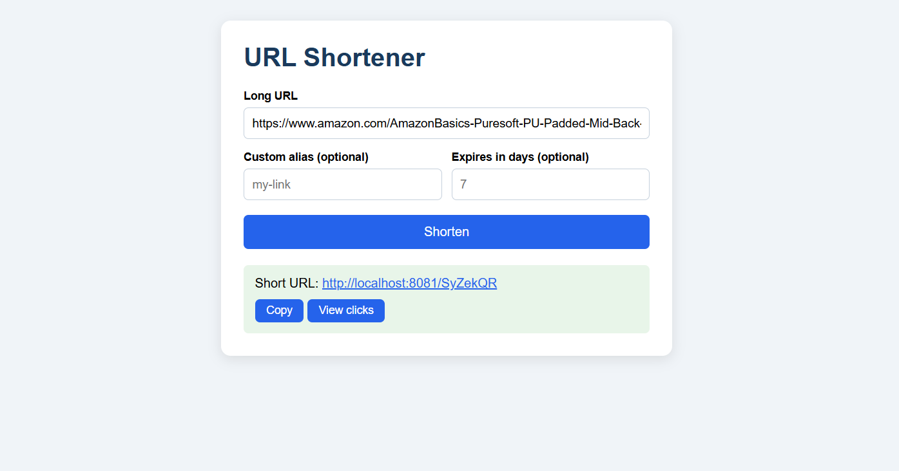

# URL Shortener

A URL shortener built with **Java 17, Spring Boot 3 and Spring Data JPA**, with a simple web front-end. Paste a long link, get a short one, and track how many times it is clicked.

**Live demo:** [add your Render link here]

## Screenshot


## Features
- Shorten any http/https URL
- Optional custom alias (4-20 characters)
- Optional link expiry (in days)
- Click tracking and stats
- Input validation with clean JSON error responses
- Simple web page to create and copy links
- Docker support for deployment

## Tech Stack
- Java 17
- Spring Boot 3 (Web, Data JPA, Validation)
- H2 database
- HTML, CSS, JavaScript
- Maven
- Docker

## API Endpoints
| Method | Endpoint | Description |
|--------|----------|-------------|
| POST | `/api/shorten` | Create a short URL |
| GET | `/{code}` | Redirect to the original URL |
| GET | `/api/stats/{code}` | Get click statistics |

Example request:

```json
POST /api/shorten
{
  "url": "https://www.example.com/very/long/link",
  "customAlias": "my-link",
  "expiryDays": 7
}
```

Example response:

```json
{
  "shortCode": "my-link",
  "shortUrl": "http://localhost:8081/my-link",
  "originalUrl": "https://www.example.com/very/long/link",
  "expiresAt": "2026-09-27T10:00:00Z"
}
```

## Run Locally
Requirements: Java 17+ and Maven.

```bash
git clone https://github.com/omcontributes/url-shortener-springboot.git
cd url-shortener-springboot
mvn spring-boot:run
```

Then open http://localhost:8081

## Project Structure
```
src/main/java/com/example/urlshortener
├── controller   REST endpoints and redirect
├── service      Business logic
├── model        JPA entity
├── repository   Database access
├── dto          Request and response objects
└── exception    Custom exceptions and global handler
```

## How It Works
1. The client sends a long URL to `POST /api/shorten`.
2. The service validates the URL and generates a random 7-character code (or uses the custom alias).
3. The mapping is saved in the database.
4. Opening `/{code}` looks up the original URL, increments the click count, and sends a 302 redirect.

## Notes
The app uses an in-memory H2 database, so links are cleared when the app restarts.

## Future Improvements
- PostgreSQL for persistent storage
- Redis caching for faster redirects
- Rate limiting
- QR code generation
- User accounts and link management

## Author
**Om Shailendra Amrale** - [GitHub](https://github.com/omcontributes)